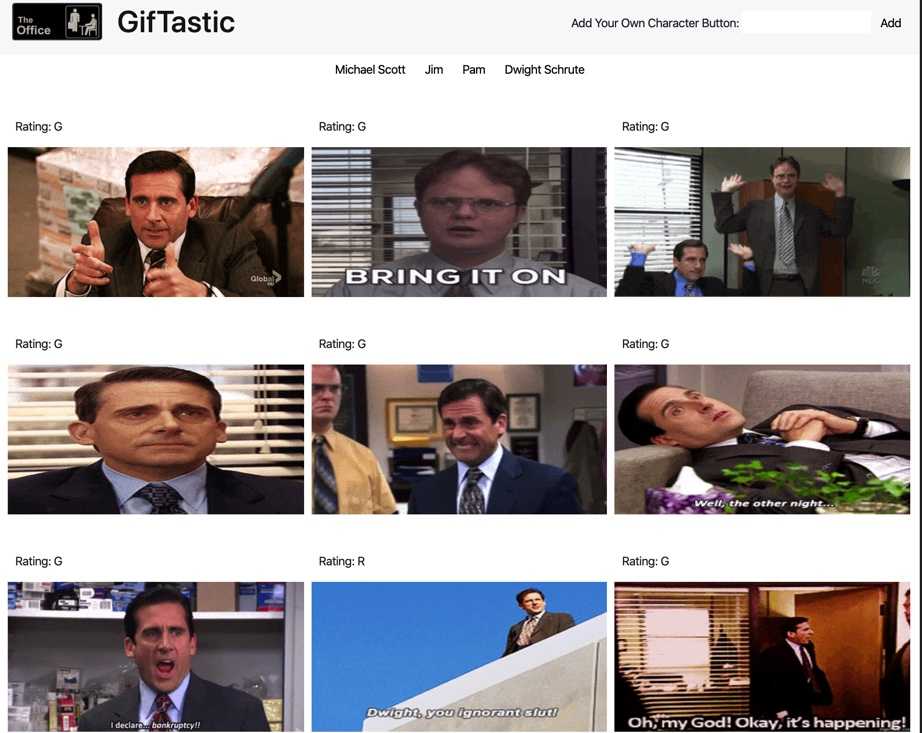
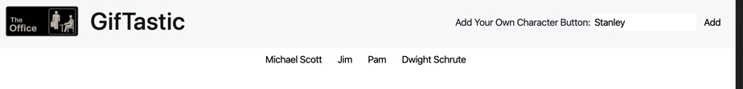
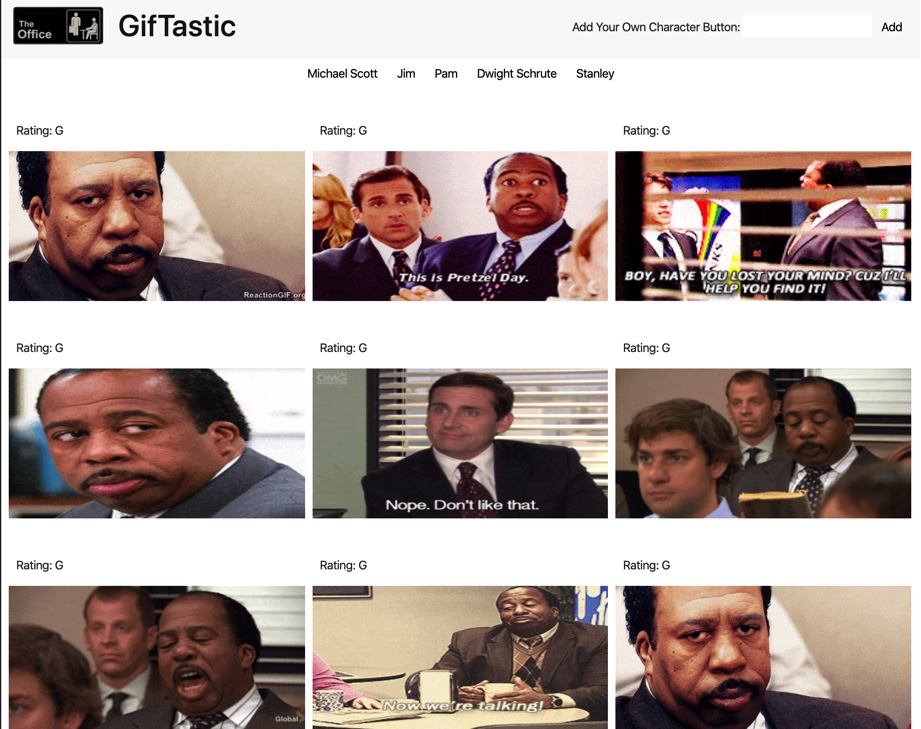

# GifTastic 

Demo a live version of this application here: [https://mkchung8.github.io/GifTastic/]

A dynamic webpage utilizing GIPHY API to populate a collection of gifs related to The Office. This was done by using JavaScript and jQuery to dynamically change HTML elements. 

Users can find a collection of gifs of their favorite characters and utilize this web page to waste enormous amounts of time. 

## Getting Started 

To use this web application, click on th elink to the live demo listed above or clone the repositiory into your machine to deploy locally. 

To start using the application, simply click on one of the buttons listed at the top of the with different characters. Clicking on each of the buttons will display relevant gifs to the page. (Giphy API)

You can create your own character buttons by typing their name into the search bar. 

Once their name is added to the top of their page, you can click this newly added button to search your custom characters. 

## Technologies Used 
* HTML/CSS 
* JavaScript
* Node.js
* jQuery  

#### Code Created and Maintained by: 
Miyoung K. Chung 
mkchung.8@gmail.com
https://www.github.com/mkchung8/
https://www.linkedin.com/in/mkchung8/

